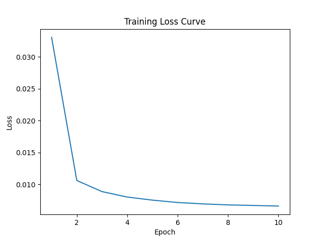
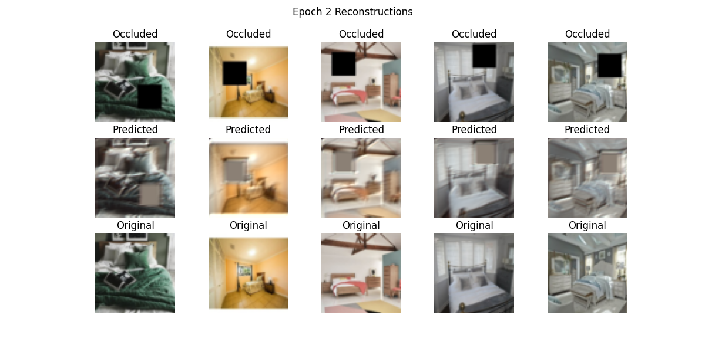
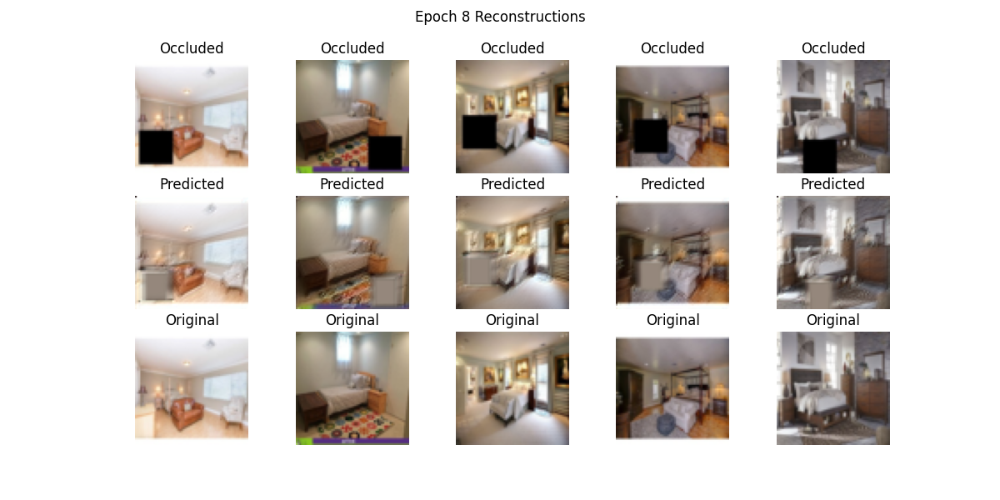
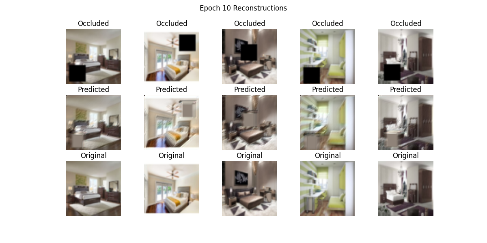

# 🧠 PixelHeal: Autoregressive Image Inpainting using PixelRNN

## 1. Introduction
This assignment focused on building a deep learning model for **image inpainting** — the process of reconstructing missing or occluded parts of an image. The goal was to develop a system that can intelligently fill in these missing regions, restoring realistic and coherent visuals.  
To achieve this, we implemented a simplified **PixelRNN**, an autoregressive neural network that predicts each pixel based on the previously generated ones. The project was divided into multiple phases covering dataset preparation, model implementation, training, evaluation, and visualization through a Streamlit app.

---

## 2. Methodology

### Dataset
We used a paired image dataset consisting of two aligned folders:
- `data/train/occluded/` — images with artificially applied occlusions.
- `data/train/original/` — their corresponding original (unmasked) images.

Each sample pair shared the same filename to ensure direct mapping between occluded and ground truth versions. Images were resized to 64×64 pixels and normalized to the [0,1] range.

### Preprocessing
- Resized all images to a uniform size (64×64).
- Converted images to tensors.
- Batched data for efficient GPU/CPU training using PyTorch’s `DataLoader`.

### Model Architecture
The **PixelRNN** model was implemented using **masked convolutional layers** to maintain the autoregressive property — ensuring that predictions for a pixel depend only on previous pixels.

**Key layers:**
- MaskedConv2d-A: Prevents the model from using future pixel information.
- MaskedConv2d-B: Allows learning from the current and past pixels.
- ReLU activations for non-linearity.
- Final convolutional layer for reconstructing RGB values.

The architecture progressively learns to predict pixel distributions conditioned on visible context.

---

## 3. Results

### Training Process
The model was trained for **20 epochs** with the following parameters:
- Optimizer: Adam (`lr = 1e-3`)
- Loss Function: Mean Squared Error (MSE)
- Batch Size: 8

The **training loss** steadily decreased, indicating that the model effectively learned to minimize reconstruction errors between occluded and original images.

### Sample Reconstructions
Every few epochs, reconstructed samples were saved to visually assess improvement.

| Occluded | Predicted (Reconstructed) | Original |
|-----------|---------------------------|-----------|
|  |  |  |

*(Images represent progressive refinement as training advanced.)*

---

## 4. Discussion
The model showed a clear progression in generating smoother and more coherent image reconstructions over time. Early epochs produced blurry outputs, while later ones restored finer details and color consistency.

**Observations:**
- The autoregressive design allowed the network to learn strong spatial dependencies.
- Some reconstructions still displayed minor color mismatches or artifacts in complex regions.
- Training on CPU was slow; using GPU acceleration significantly improved convergence speed.
- Image alignment between occluded and original pairs was crucial — missing or mismatched files caused `FileNotFoundError` issues that were later resolved.

Overall, PixelHeal demonstrated the potential of autoregressive models in image completion tasks.

---

## 5. Conclusion
This project successfully implemented and trained a **PixelRNN-based image inpainting model** capable of restoring missing parts of occluded images. The results validate the model’s ability to learn contextual pixel dependencies and progressively generate more coherent images.  
Future improvements could include:
- Scaling to higher resolutions.
- Introducing attention mechanisms.
- Using GAN-based refinements for sharper restorations.

PixelHeal represents an important step toward intelligent visual recovery systems.

---

**Author:** Ahmad Tashfeen  
**Course:** Generative AI — Assignment 2  
**Date:** October 2025
